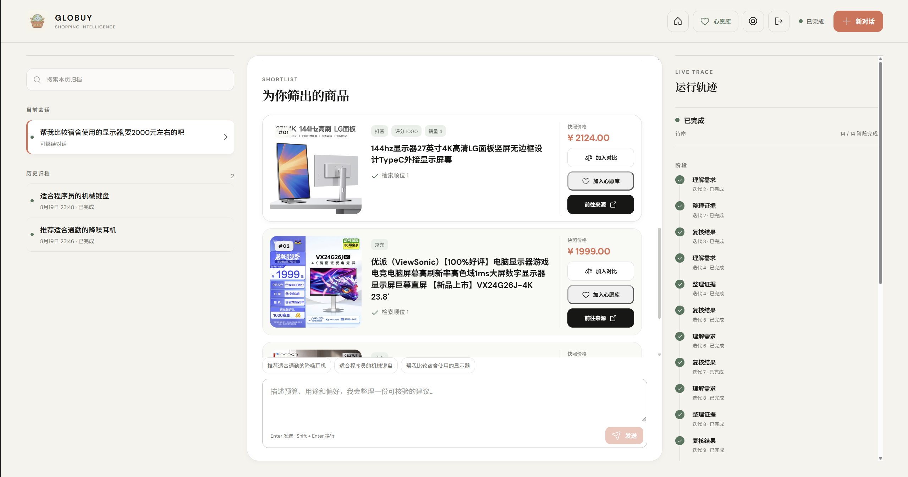
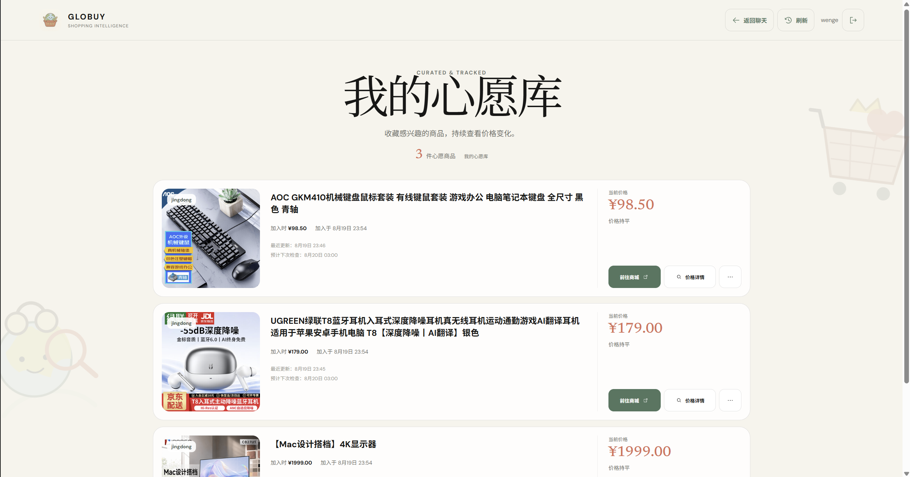
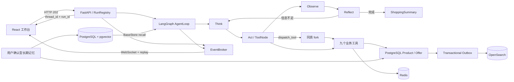

<div align="center">
  
  <h1>Globuy</h1>
  <p><strong>面向真实购物场景的对话式 Agent 系统</strong></p>
  <p>把自然语言购物需求转化为可追踪、可恢复、可核验的跨平台商品决策。</p>

  <p>
    
    
    
    
    
    
  </p>
</div>

<p align="center">
  
</p>

## 项目简介

Globuy 是一个从零设计并实现的全栈购物 Agent 项目。用户只需要描述预算、用途和偏好，系统便会将需求结构化，按需派生同质 fork 并行检索淘宝、京东和抖音候选，再完成证据整理、确定性筛选与购物清单生成。

项目重点不只是“调用一次大模型”，而是实现一条可以长期运行的 Agent 工程链路：显式阶段状态、工具边界、循环收敛、上下文压缩、用户确认型长期记忆、异步任务、WebSocket 增量事件、商品事实库、混合检索、心愿库、价格观测和离线/真实双层评测。

> [!IMPORTANT]
> 仓库不会伪造商品、价格、库存或外部检索结果。未配置模型、Provider、OpenSearch 或数据包时，相关能力返回 `not_configured`；自动测试不调用真实付费服务。

## 实机演示

### 对话式选品与运行轨迹

用户输入预算和用途后，前端持续展示 Agent 阶段、工具调用和完成状态，并将经过验证的候选渲染为可比较、可收藏、可追溯来源的商品卡片。



### 心愿库与价格追踪

推荐商品可以进入用户心愿库。系统保留加入价格、当前价格、最近观测时间和下一次检查时间，并支持手动刷新与独立价格 Worker。



## 已实现能力

| 模块 | 当前实现 |
|---|---|
| AgentLoop | 使用 LangGraph 显式建模 `Think → Act → Observe → Reflect`，九个业务工具按阶段白名单调用 |
| 同质 fork | 主 Agent 通过 `dispatch_tool` 按需派生子任务；fork 继承完整工具集与 System Prompt，拥有独立 thread/checkpoint，最大深度固定为 1 |
| Harness 防护 | 决策预算、循环指纹检测、主循环递归上限、fork 90 秒超时、候选截断与确定性终结，避免无效自旋和上下文膨胀 |
| Cache Breakpoint | 在 Observe 后压缩旧历史，保留最近 3 个完整工具调用组和合法的 tool-call/tool-result 配对 |
| 长期记忆 | PostgreSQL 保存用户确认的偏好事实和版本；pgvector + 关键词 RRF 检索，支持候选确认和软衰减 |
| 商品检索 | 结构化意图、目录覆盖检查、可选 Provider 补库、PostgreSQL Product/Offer、Outbox 投影和 OpenSearch Hybrid Search |
| 混合召回 | `BM25(title) + BAAI/bge-m3 Dense Vector + Lucene HNSW/COSINE + 无权重 RRF`；平台前置过滤，价格/评分/销量/属性后置过滤 |
| 实时任务 | FastAPI 返回 HTTP `202`，后台执行 Agent；WebSocket 按 thread/run 推送带 sequence 的事件，支持 replay、心跳、多订阅、取消与终态恢复 |
| 用户系统 | Argon2id 密码哈希、服务端可撤销会话、HttpOnly Cookie、CSRF、幂等写入和资源归属校验 |
| 产品闭环 | React 工作台、会话归档、商品卡片、比较、来源链接、心愿库、价格历史、长期记忆管理和响应式布局 |
| 评测体系 | YAML 双层用例、P0 确定性事实/安全门禁、可选独立 LLM Judge、正式 HTTP/WS live runner、脱敏轨迹和 Markdown 报告 |

## 核心技术亮点

### 1. 主 Agent + 同质 fork，而不是九个独立 Agent

九个工具属于主 AgentLoop 的行动空间。单平台需求由主 Loop 直接处理；明确的多平台任务由 `dispatch_tool` 创建同质 fork 并行执行。子任务共享模型实例、工具定义和 System Prompt，但使用独立 `thread_id` 与 checkpointer，结果压缩后回流父 Loop 的 Observe/Reflect 阶段。

当前九个业务工具为：`Planner`、`ChatFallback`、`WebSearch`、`CategoryInsight`、`ItemSearch`、`ItemPicker`、`PriceCompare`、`ShippingCalc` 和 `ShoppingSummary`；`dispatch_tool` 是 fork 元工具，不计入九个业务工具。

### 2. 可收敛的生产型 AgentLoop

LLM 决策之外还存在确定性控制层：阶段工具白名单阻止跨阶段调用；滑动窗口对工具名、参数和结果摘要建立循环指纹；达到决策预算或发现重复无进展时，根 Agent 会基于已经验证的检索结果调用确定性 Picker 和 Summary 收尾。fork 深度固定为 1，单路候选回流上限为 10 条。

### 3. Cache Breakpoint 上下文压缩

长对话不会在每轮无边界累积。系统在 Observe 后识别历史边界，保留稳定 Prompt 前缀、当前约束和最近 3 个完整工具调用组，用摘要替换更旧历史，同时保证未完成工具调用及其结果不会被拆散。该机制已经接入主图，而不是独立演示脚本。

### 4. PostgreSQL 事实库 + pgvector/OpenSearch 检索

PostgreSQL 是用户、会话、任务、Product、Offer、价格观测、心愿库和长期记忆的权威事实库。pgvector 承担长期记忆语义投影，OpenSearch 继续负责商品与品类知识检索。事务 Outbox 将事实写入与异步投影解耦，支持失败重试、幂等更新和索引重建。

### 5. AG-UI 风格事件与可恢复 WebSocket

正式任务通过 HTTP `202` 立即返回 `thread_id/run_id`，WebSocket 只负责订阅增量事件。EventBroker 为事件分配严格递增的 sequence，维护有界重放缓冲和独立订阅队列；客户端断线后可携带游标恢复，遇到 replay gap 会显式同步任务状态。成功、失败和取消均走统一终态与清理路径。

### 6. 不以手写综合分伪装模型效果

商品搜索固定采用 BM25 与冻结 BGE-M3 的无权重 RRF 名次融合；ItemPicker 只依据检索排名、评分、价格和输入顺序执行确定性选择。项目当前不训练或微调 Query/User/Item 编码器，也不建设 SFT、Agentic RL 或依赖人工标签的学习排序闭环。

## 系统架构



## 一次购物请求如何执行

1. FastAPI 校验用户会话、CSRF 和幂等键，创建 run 后立即返回 `202`。
2. Agent 从 PostgreSQL/pgvector 读取当前用户已确认的相关偏好，拼装本轮上下文。
3. Think/Planner 提取品类、预算、平台和硬约束；多平台任务可派生同质 fork。
4. ItemSearch 检查目录覆盖；本地目录不足且 Provider 明确启用时，受控补充候选并写入 PostgreSQL。
5. Product Outbox 将活动 Offer 批量投影到 OpenSearch，执行 BM25 + Dense Vector + RRF 检索。
6. Observe/Reflect 检查工具结果、循环状态和约束满足情况，必要时继续检索或确定性收尾。
7. ShoppingSummary 输出带价格、平台、理由和来源链接的清单；前端通过 WebSocket 增量呈现全过程。

## 技术栈

| 层级 | 技术 |
|---|---|
| Agent | LangChain 1.x、LangGraph 1.x、OpenAI-compatible Chat Model |
| Backend | Python 3.12、FastAPI、Uvicorn、Pydantic、SQLAlchemy Async、Alembic |
| Retrieval | OpenSearch 3.7、BGE-M3、BM25、Lucene HNSW、RRF；Faiss 仅作实验性 ANN |
| Data | PostgreSQL 17、pgvector 0.8、Redis 7、Transactional Outbox |
| Frontend | React 19、TypeScript 5.8、Vite 7、Vitest |
| Protocol | HTTP 202、WebSocket、AG-UI 风格事件、sequence replay |
| Quality | Pytest、Ruff、双层 Eval、可选独立 LLM Judge |

## 快速开始

默认演示模式使用 `mock` 模型，不调用 DeepSeek、Tavily 或商品 Provider。完整商品检索还需要 OpenSearch、Redis、BGE-M3 模型缓存和有权使用的商品数据。

### 环境要求

- Miniconda / Anaconda
- Python 3.12（项目固定使用 Conda 环境 `globuy`）
- Node.js 20.19+
- Docker Desktop 与 Docker Compose
- Docker Desktop（运行 PostgreSQL 17 + pgvector；完整检索还会运行 OpenSearch/Redis）

### 1. 克隆与安装

```powershell
git clone https://github.com/yachtywen/Globuy.git
Set-Location Globuy

conda env create -f environment.yml
conda activate globuy

Push-Location frontend
npm ci
Pop-Location
```

### 2. 配置 PostgreSQL 与本地环境

项目正式接口依赖 PostgreSQL 17 + pgvector；未配置数据库时后端会拒绝启动。先复制配置模板，将模板中的 PostgreSQL 密码替换为本地随机密码，再启动数据库并执行迁移：

```powershell
Copy-Item .env.example .env

# 在 .env 中为下列三项设置同一个随机本地密码；URL 中的密码需要 URL 编码。
# GLOBUY_POSTGRES_PASSWORD
# GLOBUY_DATABASE_URL（主机通过 127.0.0.1:5433 连接）
# GLOBUY_DOCKER_DATABASE_URL（Compose 服务通过 postgres:5432 连接）

docker compose up -d --wait postgres
alembic upgrade head
```

开发演示可设置 `GLOBUY_MODEL_PROVIDER=mock`、`GLOBUY_WEB_SEARCH_PROVIDER=none`，这样不会调用付费模型或商品 Provider。不要提交 `.env`、密码、Token、数据库卷或真实 Provider 响应。

不要提交 `.env`、密码、Token、数据库卷或真实 Provider 响应。

### 3. 启动前后端

终端 A：

```powershell
conda activate globuy
python -m uvicorn app.api.server:app --host 127.0.0.1 --port 8000 --reload
```

终端 B：

```powershell
Set-Location frontend
npm run dev -- --host 127.0.0.1
```

访问 <http://127.0.0.1:5173>，注册本地账号后即可创建会话。Vite 只负责前端并将 `/api/*`、`/healthz` 代理到 `127.0.0.1:8000`；若后端未启动，页面会显示代理 500。

### 4. 启用完整检索（可选）

```powershell
docker compose up -d --wait --wait-timeout 300 postgres opensearch redis

# 需要有权使用的 Candidate 数据包
python -m app.products.import_snapshot
python -m app.search.build_index

# 可选：构建确定性品类知识卡片
python -m app.category.build_index --deterministic
```

首次建库需要下载约 2.3 GB 的 `BAAI/bge-m3`。仓库不发布 `.env`、模型缓存、数据库卷、OpenSearch 索引或未获授权的商品快照；检索结果代表数据采集时的快照，不代表实时库存或平台官方推荐。

PostgreSQL 迁移、长期记忆衰减和 Worker 运维见 [PostgreSQL 迁移实施方案](docs/pg迁移.md) 与 [接口文档](docs/globuy接口文档v1.md)。

## 测试与评测

### 后端与前端验证

```powershell
conda activate globuy
python -m ruff check app datasets tests
python -m compileall -q app datasets tests
python -m pytest -q

Push-Location frontend
npm run test
npm run build
Pop-Location
```

测试使用 Fake/Mock Encoder、OpenSearch、Agent 和 Provider，不应访问真实付费服务。最近一次记录的离线评测为 6/6 case PASS、平均分 1.000；完整验证基线和已知例外以 [项目状态](docs/project-status.md) 为准。

### 双层评测

```powershell
# 默认离线契约层：合成事实，不访问模型、Provider、数据库或向量服务
python scripts/eval_regression.py --suite offline

# 真实质量层必须使用隔离账号，并显式授权模型调用
python scripts/eval_regression.py --suite live --allow-model-calls
```

P0 事实与安全条件由代码硬判；P1/P2 可以交给独立 Judge，但 Judge 不能覆盖 P0 失败。真实层复用正式登录、CSRF、HTTP 202、任务轮询、WebSocket replay、长期记忆 API 与 PostgreSQL 商品事实。详见 [评测系统文档](docs/evaluation-system.md)。

## 项目结构

```text
globuy/
├─ app/
│  ├─ agent/          # LangGraph 主图、同质 fork、循环与压缩中间件
│  ├─ api/            # FastAPI、RunRegistry、EventBroker、WebSocket
│  ├─ tools/          # 九个业务工具
│  ├─ products/       # Product/Offer、Provider、目录、Outbox、价格 Worker
│  ├─ search/         # BGE-M3、OpenSearch Hybrid、索引生命周期
│  ├─ memory/         # BaseStore、记忆索引与 Outbox Worker
│  ├─ category/       # CategoryInsight 知识卡片 RAG
│  ├─ database/       # SQLAlchemy 模型、Repository 与会话持久化
│  └─ eval/           # 双层评测、硬门禁、Judge 与报告
├─ frontend/          # React + TypeScript + Vite 工作台
├─ alembic/           # PostgreSQL Schema 迁移
├─ tests/             # 后端离线测试
├─ eval/              # YAML 评测用例与夹具
├─ docs/              # 架构契约、接口、状态与运维文档
├─ scripts/           # 评测与验收入口
└─ compose.yaml       # API、OpenSearch、Redis 与后台 Worker
```

## 当前边界与路线

- 商品与价格来自已授权 Provider 或离线快照；失败时不生成占位数据。
- 默认 `GLOBUY_PRODUCT_PROVIDER=none`，不会静默产生付费调用。
- ItemSearch 固定使用 OpenSearch Hybrid；Faiss 不作为故障时的静默后备。
- 长期记忆只写入用户明确确认的内容，不把一次浏览自动升级为永久偏好。
- 当前不包含 SFT、Agentic RL、三塔训练或学习排序；这些内容不得作为已实现成果描述。
- 首版 RunRegistry/EventBroker 是单进程边界；启用多 worker 前需要迁移到共享任务和事件基础设施。

后续任务、当前差距和每次验证记录见 [docs/ToDo.md](docs/ToDo.md) 与 [docs/project-status.md](docs/project-status.md)。

## 相关文档

- [v1 接口文档](docs/globuy接口文档v1.md)
- [项目状态与验证基线](docs/project-status.md)
- [向量与检索固定契约](docs/vector-infrastructure.md)
- [ItemSearch 无训练方案](docs/itemsearch-no-training-implementation-plan.md)
- [AgentLoop 收尾实现](docs/itempicker-agentloop-10-14-implementation.md)
- [双层评测系统](docs/evaluation-system.md)
- [PostgreSQL 与 pgvector 迁移](docs/pg迁移.md)

## 说明

Globuy 是一个以 Agent 工程化、检索系统和全栈产品闭环为重点的个人学习项目。项目代码为独立实现；参考资料用于理解业务和架构目标，不代表复制了任何未公开源码。
