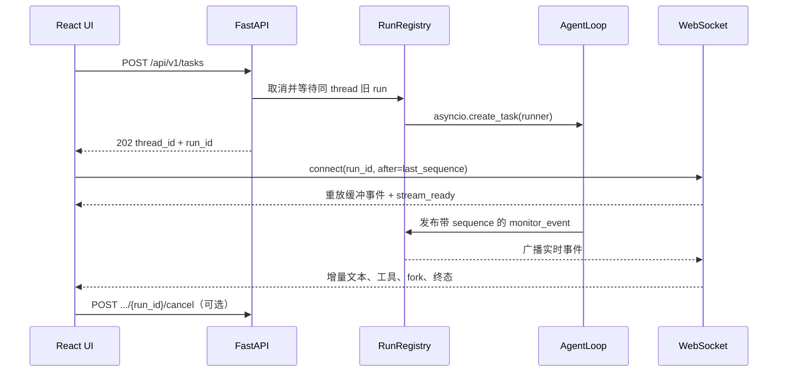

# globuy 前端任务、WebSocket 与事件流接口契约

> 状态：FastAPI、SQLite、后台任务、事件 Broker、WebSocket、产物接口和 React + Vite 正式
> 工作台均已于 2026-07-20 实现。
> 依据：飞书《Globuy项目整理》第 14 点、当前仓库代码和
> `docs/systematic-design-prompt.json`。当前实现事实与仍存差距见第 2 节。

## 1. 范围与固定边界

本文只定义浏览器到 globuy 后端之间的任务生命周期：

```text
POST 创建任务 -> 后台 AgentLoop -> WebSocket 订阅/重放事件
                                  -> 取消任务
                                  -> 查询终态/下载产物
```



固定边界：

- 任务输入首期只接受文本。当前 DeepSeek 配置不是多模态模型，不设计参考图上传入口。
- `thread_id` 表示会话，`run_id` 表示该会话中的一次执行；两者不能互相替代。
- 同一 `thread_id` 同时最多一个活跃 run。新 run 必须先取消并等待旧 run 清理完成。
- WebSocket 只订阅事件，不在连接内启动 AgentLoop。
- 断开 WebSocket 不取消任务；刷新页面后可用事件游标继续订阅。
- 前端不得展示原始思维链。阶段事件只包含 `think/act/observe/reflect/done` 等可展示状态。
- 当前商品是离线快照；前端不得把价格或库存标成实时数据。
- 商品卡片只在 `rating`、`sales` 非 `null` 时展示相应字段；缺失值不显示“未提供”等占位文案。
- 当前搜索快照基本没有可核验的运费，前端统一不展示 `shipping_fee` 或 `total_cost`。字段仍保留在
  后端工具契约中，供将来获得可核验费用时使用，不能按 0 元推断。
- 长期记忆只有 BaseStore 接口位。`learned_preferences` 是待持久化结构，不得显示为“已记住”。
- 本接口不改变 ItemSearch、CategoryInsight、fork 深度或 ShoppingSummary 的既有实现边界。

## 2. 当前实现与目标接口的区别

| 能力 | 当前代码 | 后续差距 |
|---|---|---|
| HTTP 任务 | `POST /api/v1/tasks` 已返回 `202` 并后台执行 | 已由 React 正式接入 |
| WebSocket | 已只订阅指定 `thread_id/run_id`，断开不取消任务 | React 已实现重连与游标管理 |
| 任务注册表 | 已实现 `active_tasks`、user/thread 锁和对象身份清理 | 多进程共享注册表不在首版范围 |
| 取消 | 已实现 run-aware、幂等取消和替换/归档前等待 | 外部 Provider 的取消能力取决于其客户端 |
| 事件信封 | 已统一为 `type="monitor_event"`，事件名位于 `event` | React reducer 已消费并去重 |
| 重放 | 已实现有界缓冲、严格 sequence、replay gap 和独立订阅队列 | 进程重启后不恢复过程事件 |
| 心跳 | 已实现服务端应用层心跳 | 前端已实现 45 秒陈旧检测 |
| 多连接 | 已按 thread/run 隔离，多标签页准确移除 | window focus 会同步真实活动会话 |
| 文件上传 | `/files` 仅保留兼容调试，正式任务不使用 | 图片理解不在首版范围 |
| 文件下载 | 已按 manifest/file_id 安全下载并拒绝越界 | 当前 Agent 尚不生成真实报告文件 |
| React | API client + reducer + Hook + 只订阅 EventStream + 安全 Markdown + ArtifactList + 三栏响应式工作台 | 完整多标签页浏览器 E2E 可继续补充 |

因此前端正式页面必须直接接入本文已经上线的任务/订阅协议，不能继续封装旧的“WS 发消息即
运行”调试协议；`/chat` 可暂时保留为调试兼容接口，但不作为新页面主链路。

## 3. 标识、时间和版本

### 3.1 标识语义

| 字段 | 格式 | 生成方 | 语义 |
|---|---|---|---|
| `thread_id` | 1～128 位 `[A-Za-z0-9_-]` | 后端生成，前端复用 | 一段可连续对话的会话 |
| `run_id` | 后端生成的不透明字符串 | 后端 | 一次不可复用的 Agent 执行 |
| `event_id` | 不透明字符串 | 事件发布器 | 单个事件的稳定去重键；持久业务事件建议为 `{run_id}:{sequence}` |
| `sequence` | 从 1 开始的整数或 `null` | 事件发布器 | 当前 run 内严格递增的重放游标；连接级控制事件为 `null` |
| `message_id` | 不透明字符串 | 后端 | 一条流式 assistant 消息 |
| `tool_call_id` | 不透明字符串 | Agent/ToolNode | 一次工具调用 |
| `file_id` | 不透明字符串 | 后端 | 一个可下载产物，不能当文件路径使用 |

客户端提供非法 `thread_id` 时返回 `422`，不能像当前 `_safe_thread_id()` 一样静默替换为另一个
ID，否则浏览器会订阅错误会话。`run_id` 永远由后端生成。

### 3.2 通用规则

- HTTP 路径统一使用 `/api/v1`。
- JSON 字段使用 `snake_case`。
- 时间使用 UTC RFC 3339，例如 `2026-07-20T08:30:00.123Z`。
- `schema_version` 首版为 `"1.0"`；新增可选字段不升级主版本，删除、重命名或改变语义才升级。
- 所有响应使用 UTF-8。Markdown 只作为字符串传输，不在后端生成 HTML。

## 4. HTTP 接口总览

| 方法 | 路径 | 用途 | 状态 |
|---|---|---|---|
| `GET` | `/api/v1/threads` | 列出活动或归档会话 | 已实现 |
| `POST` | `/api/v1/threads` | 创建首个会话或归档并新建 | 已实现 |
| `GET` | `/api/v1/threads/{thread_id}` | 读取只读会话详情 | 已实现 |
| `POST` | `/api/v1/tasks` | 创建后台 run | 已实现 |
| `GET` | `/api/v1/threads/{thread_id}/runs/{run_id}` | 查询状态、终态和重连基线 | 已实现 |
| `POST` | `/api/v1/threads/{thread_id}/runs/{run_id}/cancel` | 取消准确的 run | 已实现 |
| `WS` | `/api/v1/ws/{thread_id}?run_id=...&after=...` | 订阅和重放事件 | 已实现 |
| `GET` | `/api/v1/threads/{thread_id}/runs/{run_id}/files` | 列出本 run 产物 | 已实现 |
| `GET` | `/api/v1/threads/{thread_id}/runs/{run_id}/files/{file_id}` | 下载产物 | 已实现 |
| `GET` | `/healthz` | 服务健康检查 | 当前已有 |

`POST /api/v1/chat` 和 `POST /api/v1/files` 是当前调试兼容接口，不属于正式前端任务流。

## 5. 创建后台任务

### 5.1 `POST /api/v1/tasks`

请求：

```json
{
  "query": "帮我从淘宝、京东和抖音筛选 500 元以内的降噪耳机",
  "thread_id": "web_01J2EXAMPLE",
  "user_id": "anonymous_x",
  "client_request_id": "01J2CLIENTREQUEST"
}
```

字段：

| 字段 | 必填 | 约束 | 说明 |
|---|---|---|---|
| `query` | 是 | 1～20000 字符，trim 后非空 | 文本购物意图 |
| `thread_id` | 是 | 合法且属于该用户的活动会话 ID | 首个会话通过 `POST /threads` 创建 |
| `user_id` | 是 | 1～128 字符不透明字符串 | 当前是本地会话所有者，不是认证身份，也不触发记忆读写 |
| `client_request_id` | 是 | 每次点击生成、重试复用 | 防止网络重试重复创建 run |

成功返回 `202 Accepted`：

```json
{
  "status": "starting",
  "thread_id": "web_01J2EXAMPLE",
  "run_id": "01J2RUNEXAMPLE",
  "replaced_run_id": null,
  "created_at": "2026-07-20T08:30:00.123Z",
  "ws_url": "/api/v1/ws/web_01J2EXAMPLE?run_id=01J2RUNEXAMPLE&after=0",
  "status_url": "/api/v1/threads/web_01J2EXAMPLE/runs/01J2RUNEXAMPLE"
}
```

语义：

1. 后端按 `thread_id` 取得异步锁。
2. 若存在旧活跃 run，调用 `cancel()`，等待其 `finally` 完成，再创建新 run。
3. 若旧 run 在清理上限内无法结束，不允许两个 run 重叠；返回 `409 RUN_REPLACEMENT_TIMEOUT`。
4. 创建 `RunHandle`、事件缓冲和 `asyncio.Task` 后立即返回，不等待 AgentLoop 完成。
5. 相同 `client_request_id` 的重试返回同一个 `thread_id/run_id`，不能创建第二个任务。

`replaced_run_id` 非空表示本请求已安全替换旧 run。前端可以保留旧事件供用户查看，但所有新操作
必须切换到返回的 `run_id`。

### 5.2 创建错误

| HTTP | `code` | 前端行为 |
|---|---|---|
| `422` | `VALIDATION_ERROR` | 标记输入字段，不重试 |
| `409` | `RUN_REPLACEMENT_TIMEOUT` | 显示旧任务仍在清理，允许稍后重试 |
| `429` | `TOO_MANY_REQUESTS` | 按 `Retry-After` 重试 |
| `503` | `AGENT_NOT_CONFIGURED` | 显示服务未配置，不自动重试 |

## 6. 查询 run 状态

### 6.1 `GET /api/v1/threads/{thread_id}/runs/{run_id}`

该接口服务三个场景：WebSocket 建连前预检、重放间隙恢复、页面刷新后取得终态。

```json
{
  "thread_id": "web_01J2EXAMPLE",
  "run_id": "01J2RUNEXAMPLE",
  "status": "running",
  "created_at": "2026-07-20T08:30:00.123Z",
  "started_at": "2026-07-20T08:30:00.130Z",
  "finished_at": null,
  "last_sequence": 18,
  "earliest_available_sequence": 1,
  "terminal_event": null,
  "result": null,
  "artifacts": [],
  "memory_status": "not_configured"
}
```

`status` 枚举：

```text
starting | running | cancelling | succeeded | cancelled | failed | interrupted
```

终态时 `result` 使用第 10 节的 `TaskResult`。事件缓冲过期不应删除终态摘要和产物清单；前端即使
无法补齐全部过程事件，仍能恢复最终回答。

## 7. 取消任务

### 7.1 `POST /api/v1/threads/{thread_id}/runs/{run_id}/cancel`

请求体可为空。成功返回 `202`：

```json
{
  "status": "cancelling",
  "thread_id": "web_01J2EXAMPLE",
  "run_id": "01J2RUNEXAMPLE",
  "requested_at": "2026-07-20T08:31:00.000Z"
}
```

取消是幂等操作：

- run 正在执行：转为 `cancelling`，向根 AgentLoop 注入 `CancelledError`。
- 已经是 `cancelling`：仍返回 `202`。
- 已终结：返回 `200` 和真实终态，不伪装为刚刚取消。
- `thread_id` 存在但 `run_id` 不是该 run：返回 `404 RUN_NOT_FOUND`，绝不取消当前新 run。

取消请求成功只表示“取消已受理”。前端保持 `cancelling`，直到收到 `TASK_CANCELLED`；若连接中断，
通过状态接口确认。取消必须自然传播到 fork、工具和 ShoppingSummary 内部 LLM。runner 等待嵌套
工作清理后，在上下文仍有效时保存并发布终态；随后由 `finally` 用对象身份清理任务注册表并重置
ContextVar。

任务注册表清理必须比较对象身份：

```python
if active_tasks.get(thread_id) is handle:
    active_tasks.pop(thread_id, None)
```

旧任务禁止直接 `pop(thread_id)`，否则可能删除随后建立的新任务。

### 7.2 后端注册表生命周期

首版建议把 `RunRegistry` 挂到 `app.state` 并由 FastAPI lifespan 创建/关闭，避免模块级字典在测试
应用之间相互污染。注册表至少包含：

```text
active_tasks: thread_id -> RunHandle
runs: (thread_id, run_id) -> RunRecord
thread_locks: thread_id -> asyncio.Lock
```

`RunHandle` 持有 `run_id/task/done_event/status`；`RunRecord` 持有事件缓冲、终态摘要和产物 manifest。
应用关闭时必须 cancel 并 await 全部活跃 task，再关闭连接。

这一首版是单进程内存契约：Uvicorn 只能运行一个 worker。若以后启用多 worker 或多实例，必须先
把任务注册、事件缓冲和跨实例广播迁移到共享基础设施；在此之前不得宣称支持横向扩容或进程重启
后的事件恢复。

## 8. WebSocket 订阅、重放与心跳

### 8.1 建连

```text
WS /api/v1/ws/{thread_id}?run_id={run_id}&after={last_sequence}
```

- `run_id` 必填，防止同一 thread 的旧页面混入新 run 事件。
- `after` 缺省为 0；服务端先补发 `sequence > after` 的缓冲事件，再广播实时事件。
- 补发和实时发送必须经过同一连接级发送锁，避免交错乱序。
- 同一 run 可有多个 WebSocket；一个标签页断开只能删除对应 socket。
- 客户端断开不取消后台任务。

服务端完成历史补发后发送连接级 `CUSTOM/stream_ready`，表明随后进入实时流：

```json
{
  "type": "monitor_event",
  "schema_version": "1.0",
  "event": "CUSTOM",
  "event_id": "connection_7f3a:ready",
  "sequence": null,
  "thread_id": "web_01J2EXAMPLE",
  "run_id": "01J2RUNEXAMPLE",
  "timestamp": "2026-07-20T08:30:01.000Z",
  "message": "事件流已连接",
  "data": {
    "name": "stream_ready",
    "replayed_through": 18,
    "earliest_available_sequence": 1
  }
}
```

### 8.2 事件缓冲

可重放业务事件由统一 publisher 按以下顺序处理：

```text
分配 sequence/event_id -> 写入 run buffer -> 广播到所有订阅连接
```

建议首版默认每 run 最多保留 2000 个事件、终态后保留 30 分钟；两者应成为后端配置而非前端
假设。超过边界时只丢最旧过程事件，保留终态摘要。若 `after` 早于现存最早游标，先发送
`CUSTOM/replay_gap`，前端调用状态接口恢复最终结果，并在 UI 标注“部分历史事件不可用”。

`CUSTOM/stream_ready` 和 `CUSTOM/heartbeat` 是连接级控制事件，不进入 run buffer，
`sequence=null`，也不参与业务事件去重或 EventStream 展示。

`timestamp` 不能用于排序或去重；只使用 `sequence`。

### 8.3 心跳

服务端每 20 秒发送连接级 `CUSTOM/heartbeat`。前端记录最后收到任何消息的时间；连续 45 秒没有任何
事件即主动关闭并重连。浏览器 WebSocket API 不暴露协议层 Ping，因此不依赖字符串 `ping/pong`
作为唯一保活机制。

### 8.4 关闭码

| 关闭码 | 含义 | 前端处理 |
|---|---|---|
| `1000` | 正常关闭 | run 已终结时不重连 |
| `1001` | 服务重启/离开 | 非终态时重连 |
| `4400` | 参数非法 | 不重试，显示协议错误 |
| `4404` | thread/run 不存在 | 查询状态；确认不存在后停止 |
| `4408` | 订阅超时 | 带最后游标重连 |
| `1011` | 服务端异常 | 指数退避重连，并查询状态 |

## 9. `monitor_event` 统一信封

所有 WebSocket 业务消息使用同一结构：

```ts
export type MonitorEvent<E extends MonitorEventName = MonitorEventName> = {
  type: "monitor_event";
  schema_version: "1.0";
  event: E;
  event_id: string;
  sequence: number | null;
  thread_id: string;
  run_id: string;
  timestamp: string;
  message?: string;
  data: Record<string, unknown>;
};
```

`event` 使用项目已有的 AG-UI 风格名称：

```ts
export type MonitorEventName =
  | "RUN_STARTED"
  | "STEP_STARTED"
  | "STEP_FINISHED"
  | "TOOL_CALL_START"
  | "TOOL_CALL_ARGS"
  | "TOOL_CALL_RESULT"
  | "TOOL_CALL_END"
  | "TEXT_MESSAGE_START"
  | "TEXT_MESSAGE_CONTENT"
  | "TEXT_MESSAGE_END"
  | "RUN_FINISHED"
  | "RUN_ERROR"
  | "TASK_CANCELLED"
  | "CUSTOM";
```

约束：

- 前端先校验 `type/schema_version/thread_id/run_id/sequence`，再按 `event` 分派；只有
  `CUSTOM/stream_ready` 与 `CUSTOM/heartbeat` 允许 `sequence=null`。
- 未知 `event` 必须保留到调试日志并安全忽略，不能让页面崩溃。
- `data` 是事件专属对象；前端不依赖后端 Python 类名。
- 参数和结果已经由 Monitor 脱敏与截断；事件中不出现密钥、Prompt、向量、原始证据或思维链。
- 标准工具事件只由 ToolNode 包装器产生一次，工具内部领域指标只能使用不同的 CUSTOM 名称。

## 10. 事件目录与数据结构

### 10.1 生命周期事件

| `event` | `data` | 前端动作 |
|---|---|---|
| `RUN_STARTED` | `{started_at}` | 状态置为 `running` |
| `RUN_FINISHED` | `{duration_ms, metadata}` | 状态置为 `succeeded`，停止重连 |
| `TASK_CANCELLED` | `{cancelled_at, reason}` | 状态置为 `cancelled`，停止重连 |
| `RUN_ERROR` | `{code, message, retryable}` | 状态置为 `failed`；仅 `retryable=true` 提示重试 |

每个 run 必须且只能出现一个终态事件：`RUN_FINISHED`、`TASK_CANCELLED`、`RUN_ERROR` 三选一。

### 10.2 阶段事件

```json
{
  "event": "STEP_STARTED",
  "data": {"phase": "reflect", "iteration": 6}
}
```

`phase` 只允许 `think/act/observe/reflect/done`。EventStream 可显示“理解需求、执行工具、整理结果、
检查是否充分、已完成”等用户可理解标签，不展示模型推理文本。

### 10.3 工具事件

```json
{"event":"TOOL_CALL_START","data":{"tool_call_id":"call_1","tool_name":"item_search"}}
{"event":"TOOL_CALL_ARGS","data":{"tool_call_id":"call_1","arguments":{"platform":"taobao","query":"降噪耳机"}}}
{"event":"TOOL_CALL_RESULT","data":{"tool_call_id":"call_1","result":{"status":"ok","candidate_count":10,"truncated":true}}}
{"event":"TOOL_CALL_END","data":{"tool_call_id":"call_1","status":"ok","duration_ms":842}}
```

前端按 `tool_call_id` 折叠为一张工具卡，不把四个事件渲染成四条互不相关的日志。结果超过后端
预算时包含明确的 `truncated=true`；前端不得猜补被截断内容。

### 10.4 fork 事件

fork 沿用 `CUSTOM`：

```json
{
  "event": "CUSTOM",
  "message": "已派发子任务",
  "data": {
    "name": "agent_fork",
    "child_thread_id": "web_01J2EXAMPLE-fork-a1b2c3",
    "reason": "检索淘宝耳机",
    "tool_names": ["planner", "item_search", "item_picker"]
  }
}
```

EventStream 只展示可读的 `reason` 和子任务状态。fork 最大深度固定为 1，不绘制无限树。

### 10.5 文本事件

```json
{"event":"TEXT_MESSAGE_START","data":{"message_id":"msg_1","role":"assistant"}}
{"event":"TEXT_MESSAGE_CONTENT","data":{"message_id":"msg_1","delta":"## 精选清单\n"}}
{"event":"TEXT_MESSAGE_END","data":{"message_id":"msg_1"}}
```

前端必须按 `message_id` 把 delta 追加到同一条 assistant 消息。当前页面每收到一个 delta 就新建
一条消息的行为需要移除。ShoppingSummary 内部模型事件可带
`model_role="shopping_summary"`；它只是显示来源，不改变拼接规则。

### 10.6 最终结果

最终结果使用 `CUSTOM/task_result`，并在 `RUN_FINISHED` 前出现：

```ts
export type TaskResult = {
  status: "complete" | "incomplete" | "not_configured" | "error";
  final_text: string;
  picks: PickedItem[];
  unresolved: string[];
  learned_preferences: PreferenceCandidate[];
  memory_status: "not_configured" | "interface_only";
  source_kind: "offline_snapshot";
  artifacts: Artifact[];
};

export type PickedItem = {
  item_id: string;
  platform: "taobao" | "jingdong" | "douyin";
  title: string;
  price: number;
  currency: "CNY";
  rating: number | null;
  sales: number | null;
  image_url: string | null;
  product_url: string;
  shipping_fee: number | null; // 当前前端不展示
  total_cost: number | null; // 当前前端不展示
  retrieval_rank: number | null;
  reasons: string[];
  flags: string[];
};
```

`learned_preferences` 当前只能标为“本次识别、尚未持久化”。`source_kind="offline_snapshot"` 必须
在结果区持续可见。商品外链使用 `target="_blank" rel="noopener noreferrer nofollow"`。

## 11. 错误响应

HTTP 非 2xx 统一返回：

```json
{
  "error": {
    "code": "RUN_NOT_FOUND",
    "message": "指定任务不存在或已过期",
    "retryable": false,
    "details": {}
  }
}
```

禁止把 Python 异常类型、堆栈、绝对路径或 Provider 原始响应直接发给浏览器。`RUN_ERROR` 使用同一
`code/message/retryable` 语义。前端显示 `message`，将 `code/run_id` 放入可复制的诊断信息。

## 12. 文件产物接口

### 12.1 列表

`GET /api/v1/threads/{thread_id}/runs/{run_id}/files`

```json
{
  "items": [
    {
      "file_id": "file_01J2",
      "filename": "shopping-summary.md",
      "kind": "shopping_summary",
      "media_type": "text/markdown",
      "size": 4096,
      "created_at": "2026-07-20T08:32:00.000Z",
      "download_url": "/api/v1/threads/web_01J2EXAMPLE/runs/01J2RUNEXAMPLE/files/file_01J2"
    }
  ]
}
```

### 12.2 下载

`GET /api/v1/threads/{thread_id}/runs/{run_id}/files/{file_id}`

- 服务器通过产物 manifest 把 `file_id` 映射到已验证的 session 子路径。
- URL 不接受 `filename` 作为磁盘查找键，不允许 `../`、绝对路径或符号链接越界。
- 响应设置正确 `Content-Type`、`Content-Disposition: attachment` 和
  `X-Content-Type-Options: nosniff`。
- 不存在返回 `404 FILE_NOT_FOUND`；不属于该 run 的 file_id 同样返回 404。
- 当前不设计上传参考图接口。现存 `/api/v1/files` 不出现在正式页面，也不得暗示模型会理解图片。

## 13. React Hook 契约

建议目录：

```text
frontend/src/
  api/taskApi.ts
  types/task.ts
  hooks/useGlobuyTask.ts
  state/taskReducer.ts
  components/TaskComposer.tsx
  components/EventStream.tsx
  components/FinalAnswer.tsx
  components/ArtifactList.tsx
  components/ConnectionStatus.tsx
```

Hook 对页面暴露：

```ts
type TaskStatus =
  | "idle" | "starting" | "running" | "cancelling"
  | "succeeded" | "cancelled" | "failed";

type ConnectionStatus =
  | "idle" | "connecting" | "open" | "reconnecting" | "closed";

type UseGlobuyTask = {
  threadId: string | null;
  runId: string | null;
  taskStatus: TaskStatus;
  connectionStatus: ConnectionStatus;
  events: MonitorEvent[];
  finalAnswer: string;
  result: TaskResult | null;
  artifacts: Artifact[];
  error: ApiError | null;
  startTask(query: string, userId?: string): Promise<void>;
  cancelTask(): Promise<void>;
  reconnectNow(): void;
  reset(): void;
};
```

实现要求：

- 任务与连接状态分开，不能用一个 `running` 布尔值表达全部生命周期。
- `runIdRef/taskStatusRef/lastSequenceRef` 始终保存最新值，WebSocket 回调不读取陈旧闭包。
- 所有状态修改进入 reducer；连接控制事件先单独处理，可重放业务事件再按
  `run_id + sequence` 去重并更新视图。
- `startTask()` 先 POST，再保存返回 ID，最后连接 WS；早期事件由 `after=0` 重放。
- 重连使用 1、2、4、8、15 秒封顶的指数退避并加入少量随机抖动；每次携带最后 sequence。
- 收到三个终态事件之一后停止重连并关闭 socket；组件卸载只关连接，不自动取消任务。
- 浏览器从离线恢复时先 GET 状态，再决定重连还是直接恢复结果。
- `cancelTask()` 捕获调用时的 thread/run 快照，不能使用后来被新任务覆盖的 ID。

## 14. EventStream 展示规则

EventStream 不是原始日志窗口，应把相关事件归并为用户能理解的运行轨迹：

| 事件 | 建议视觉 |
|---|---|
| 阶段 | 单行状态节点，显示阶段标签和迭代数 |
| fork | 一级分支卡片，显示平台/任务理由；最大深度固定为 1 |
| 工具 | 按 `tool_call_id` 折叠，展示工具名、状态、耗时和安全摘要 |
| 文本 | 不进入事件时间线，拼接到最终回答区域 |
| 错误/取消 | 功能性色彩和明确恢复动作 |
| 心跳/stream_ready | 默认不展示，仅更新连接状态 |

工具参数默认折叠，禁止显示密钥、完整 Prompt、向量和原始 RAG 证据。三个平台并行时按各自
`child_thread_id` 分组，不按到达顺序误解为串行。

## 15. Markdown 与外链安全

推荐使用 `react-markdown + remark-gfm`，默认不启用原始 HTML。若选择 `marked` 或
`markdown-it` 并使用 `dangerouslySetInnerHTML`，必须在写入 DOM 前用 DOMPurify 清洗。

最低规则：

- 禁止 `script/style/iframe/object/embed` 和内联事件属性。
- 只允许 `http/https` 外链；拒绝 `javascript:`、`data:` 等协议。
- 外链统一增加 `noopener noreferrer nofollow`。
- 图片只允许受信的 `http/https` 来源，加载失败显示占位，不把图片 URL 当 HTML 注入。
- Markdown 渲染失败时回退为纯文本，不能让最终答案消失。

## 16. 页面信息架构与设计约束

结合 `systematic-design-prompt.json`，正式页面建议采用 12 栏理性网格和“少而精”的信息层级：

```text
桌面：左侧 3 栏历史会话 | 中间 6 栏对话、结果和输入 | 右侧 3 栏 EventStream
移动端：输入 -> 状态 -> 最终答案 -> EventStream 单列堆叠
```

- 8px 基础间距；桌面 48px 页边距、24px gutter，移动端压缩为单列。
- 背景以 `#F0EFE9/#FFFFFF` 为主，橙 `#F4793E` 只用于警告/取消，绿 `#3A6B5A` 用于成功，
  蓝 `#2E4A7A` 用于进行中状态；颜色必须表达功能。
- 阴影保持克制，事件状态主要通过排版、边框和标签区分。
- 按钮、连接状态和错误均有可见焦点；文本对比度至少 4.5:1。
- 断线重连、取消中、无结果、部分结果和离线快照都必须有文字说明，不能只靠颜色。

`App.tsx` 只负责编排 `TaskComposer`、`ConnectionStatus`、`EventStream`、`FinalAnswer` 和
`ArtifactList`，网络与重连逻辑全部收敛到 Hook/API 层。

## 17. 前端 reducer 的关键行为

| 输入 | 状态变化 |
|---|---|
| POST 成功 | 保存 thread/run，`starting -> connecting` |
| `stream_ready` | connection=`open`，记录服务端已完成重放；不修改业务游标 |
| `RUN_STARTED` | task=`running` |
| `TEXT_MESSAGE_CONTENT` | 按 message_id 追加 delta |
| `task_result` | 保存结构化 result、final_text 和 artifacts |
| `RUN_FINISHED` | task=`succeeded`，关闭连接 |
| `TASK_CANCELLED` | task=`cancelled`，关闭连接 |
| `RUN_ERROR` | task=`failed`，保存错误，关闭连接 |
| socket close + 非终态 | connection=`reconnecting`，按最后游标重连 |
| `replay_gap` | GET 状态，保留“事件历史不完整”标记 |

任何属于旧 `run_id` 的迟到事件都忽略。非空 sequence 小于等于已处理游标的事件视为重放重复，
不再次执行 reducer 副作用；连接级控制事件不写入事件列表。

## 18. 后端并发与清理验收条件

后端以 Fake Agent/Fake Model 覆盖任务条件，前端 Vitest 已覆盖第 11 项：

1. POST 在 Agent 未完成时返回 `202`，并能通过 run 状态查询到 `running`。
2. HTTP 返回前产生的事件能在首次 WS 连接后完整重放。
3. 同 thread 新 run 会取消并 await 旧 run，任意时刻最多一个活跃 task。
4. 旧 runner 的 finally 不会删除新 RunHandle。
5. 取消传播到主图、fork、工具和 Summary LLM，最终只发一个 `TASK_CANCELLED`。
6. 断线重连按 sequence 补发且不重复 reducer 副作用。
7. 多 WebSocket 中断一个不会断开另一个。
8. 缓冲越界产生 `replay_gap`，状态接口仍可恢复终态。
9. 工具事件只出现一套 START/ARGS/RESULT/END，不重复。
10. 文件下载拒绝错误 run、未知 file_id、路径穿越和符号链接越界。
11. Markdown XSS 样例不能执行，外链带安全 rel 属性。
12. 所有测试使用 Fake Agent/Fake Model，不请求真实 DeepSeek 或商品 API。

## 19. 推荐实施顺序

1. ~~后端 `RunRegistry/RunHandle`、per-thread lock、状态查询和 run-aware cancel。~~ 已完成。
2. ~~Monitor 外部信封、sequence、事件缓冲、重放和心跳。~~ 已完成。
3. ~~把现有 WS 改为只订阅；保留 `/chat` 作为兼容调试接口。~~ 已完成。
4. ~~产物 manifest、列表和安全下载。~~ 接口与安全门禁已完成；当前无真实产物生成器。
5. ~~前端类型、API client、reducer 和 `useGlobuyTask`。~~ 已完成。
6. ~~EventStream、最终 Markdown、ArtifactList 和响应式布局。~~ 已完成。
7. ~~重连、取消、XSS、键盘可访问性和前端构建验收。~~ 首版已完成；完整浏览器竞态 E2E 可继续增强。

前端应以当前已实现协议建立类型和 reducer 测试，不得把旧的“WS 发消息即运行”协议封装为
正式 Hook。
